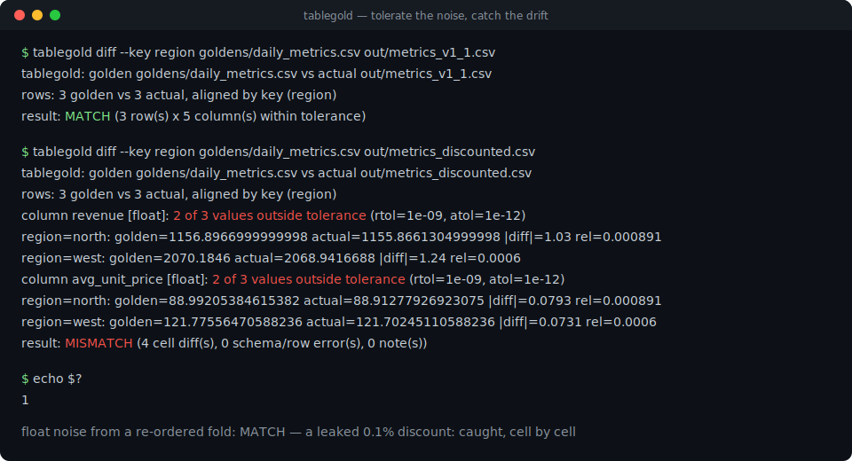
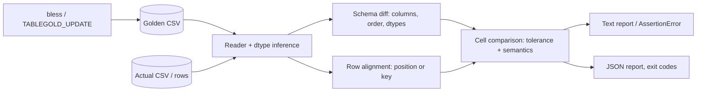

# tablegold

[English](README.md) | [中文](README.zh.md) | [日本語](README.ja.md)

[](LICENSE) [](CHANGELOG.md) [](pyproject.toml)  [](CONTRIBUTING.md)

**CSV・表形式データのためのオープンソース・ゴールデンファイルテスト——数値許容誤差、列順、dtype チェック。浮動小数点ノイズでビルドが落ちることはなく、本物のドリフトは必ず落とす。**



```bash
git clone https://github.com/JaydenCJ/tablegold && cd tablegold && pip install -e .
```

> **プレリリース：** tablegold はまだ PyPI に公開されていません。初回リリースまでは [JaydenCJ/tablegold](https://github.com/JaydenCJ/tablegold) をクローンし、リポジトリのルートで `pip install -e .` を実行してください。ランタイム依存はゼロ——標準ライブラリがスタックのすべてです。

## なぜ tablegold か？

ゴールデンファイルテストはデータパイプラインに張れる最も安価な回帰防止網です——ゴールデンがバイト単位の比較である限りは別ですが。その瞬間から、再実行のたびに `1929.6562000000001` vs `1929.6562000000004`、`1.5` vs `1.50`、無害な列の並べ替えで失敗し、チームは赤を見たら bless し直すことを覚えます。それはテストが無いのと同じです。重量級の逃げ道は、許容誤差付きの等価アサート 1 回のために dataframe ライブラリを CI に持ち込むこと。tablegold はその中間の道です：各セルの*意味*を解析するゼロ依存の比較器——数値は対称な rtol/atol、日時はタイムゾーン正規化、欠損値トークンは統一処理——列は名前で対応付け、行はキーで整列し、ドリフトは `|diff|` と `rel` の証拠付きでセル単位に報告します。許容誤差未満のノイズは通し、スキーマドリフトと本物の値ドリフトは CI が分岐できる終了コードで落とします。

|  | tablegold | pandas `assert_frame_equal` | datacompy | csv-diff |
|---|---|---|---|---|
| 数値許容誤差（rtol/atol、列単位） | あり、対称 | あり（非対称・全体） | あり（全体） | なし |
| 列順 / dtype のセマンティクス | 順序非依存、推論 dtype を検査 | `check_like` フラグ、dtype フラグ | 列チェック | 検査しない |
| キー列による行整列 | あり、重複/欠落キーも報告 | インデックスベース | あり（join） | あり |
| CI 終了コード付きの独立 CLI | あり（`diff`、0/1/2） | なし（ライブラリ内アサート） | なし（ライブラリ） | あり |
| ゴールデンのライフサイクル（bless / 更新モード） | あり（`bless`、`TABLEGOLD_UPDATE=1`） | なし | なし | なし |
| ランタイム依存 | 0 | pandas + numpy | pandas + numpy | click + dictdiffer |

<sub>依存数は 2026-07 時点で各ツールが PyPI 上で宣言するランタイム要件。tablegold の数字は [pyproject.toml](pyproject.toml) の `dependencies = []` に対応します。この比較は各ツールが文書化した守備範囲を示すもので、品質の優劣ではありません。</sub>

## 特徴

- **言った通りに効く許容誤差** — 列単位の対称な `|a-b| <= max(atol, rtol*max(|a|,|b|))`。NaN・無限大・符号付きゼロにも明示的な規則があり、1 ずれた整数カウントは rtol がいくら緩くても失敗します。
- **バイトの見た目ではなく列のセマンティクス** — 列は名前で対応付き、並べ替えは note どまり。`1.50` は `1.5` に等しく、`2026-07-01T09:00:00Z` は `+00:00` に等しく、`NA`/`null`/空文字は同じ欠損です。
- **正直に格下げする dtype チェック** — 全列に dtype を推論（`bool`/`int`/`float`/`date`/`datetime`/`string`）。int→float の拡大は note、それ以外の型ドリフトは error、`--strict-dtypes` は拡大さえ禁止します。
- **キーで整列する行** — `--key id` で順序の乱れたエクスポートもきれいに通り、重複・欠落・想定外のキーは偽 diff の壁ではなく実例値付きで報告されます。
- **すぐ動けるレポート** — 列ごとの不一致数、`|diff|`/`rel` の大きさ、例は切り詰めつつ総数は正確。ツール連携用に `--format json`（バージョン付きスキーマ）もあります。
- **ゴールデンのライフサイクル内蔵** — テストスイートには `assert_matches_golden`、pytest フィクスチャはゴールデンをテストの隣に保存、`bless` で正規化書き込み、`TABLEGOLD_UPDATE=1` でスイート全体を再 bless。

## クイックスタート

インストール：

```bash
git clone https://github.com/JaydenCJ/tablegold && cd tablegold && pip install -e .
```

あらゆる表形式出力を守れます——CSV パス、メモリ上の `list[dict]` 行、あるいは `Table`：

```python
from tablegold import assert_matches_golden

rows = build_report()  # your pipeline output
assert_matches_golden(rows, "goldens/report.csv", key=["id"], rtol=1e-9)
```

`TABLEGOLD_UPDATE=1` での初回実行がゴールデンを bless。以降は浮動小数点ノイズを通し、ドリフトは完全なレポートを携えた `AssertionError` を送出します。同じエンジンが CLI を駆動します——本リポジトリの checkout で実行（実際に取得した出力）：

```bash
tablegold diff --key region examples/goldens/daily_metrics.csv out/metrics_v1_1.csv
```

```text
tablegold: golden examples/goldens/daily_metrics.csv vs actual out/metrics_v1_1.csv
rows: 3 golden vs 3 actual, aligned by key (region)
result: MATCH (3 row(s) x 5 column(s) within tolerance)
```

この `metrics_v1_1.csv` は同じパイプラインの畳み込み順だけ変えた出力——各 revenue は浮動小数点の最下位ビットで異なりますが、どれも問題になりません。一方、紛れ込んだ 0.1% の割引は：

```bash
tablegold diff --key region examples/goldens/daily_metrics.csv out/metrics_discounted.csv
```

```text
tablegold: golden examples/goldens/daily_metrics.csv vs actual out/metrics_discounted.csv
rows: 3 golden vs 3 actual, aligned by key (region)
column revenue [float]: 2 of 3 values outside tolerance (rtol=1e-09, atol=1e-12)
  region=north: golden=1156.8966999999998 actual=1155.8661304999998  |diff|=1.03 rel=0.000891
  region=west: golden=2070.1846 actual=2068.9416688  |diff|=1.24 rel=0.0006
column avg_unit_price [float]: 2 of 3 values outside tolerance (rtol=1e-09, atol=1e-12)
  region=north: golden=88.99205384615382 actual=88.91277926923075  |diff|=0.0793 rel=0.000891
  region=west: golden=121.77556470588236 actual=121.70245110588236  |diff|=0.0731 rel=0.0006
result: MISMATCH (4 cell diff(s), 0 schema/row error(s), 0 note(s))
```

終了コードは 1、そのまま CI に組み込めます。両ファイルは `python examples/pipeline_demo.py out` で自分でも生成できます——一連の解説は [`examples/`](examples/)、判定規則の正確な定義は [`docs/comparison-semantics.md`](docs/comparison-semantics.md) にあります。

## 比較オプション

| Key | デフォルト | 効果 |
|---|---|---|
| `rtol` / `--rtol` | `1e-9` | float 列の相対許容誤差 |
| `atol` / `--atol` | `1e-12` | 絶対許容誤差の下限（ゼロ近傍で支配的） |
| `column_tolerances` / `--tol COL:RTOL[:ATOL]` | — | 列単位の上書き。その列のデフォルトを完全に置き換える |
| `key` / `--key COLS` | 位置合わせ | 位置ではなくこれらの列で行を整列 |
| `ignore_columns` / `--ignore COLS` | — | 列（タイムスタンプ、run id）を比較から除外 |
| `strict_column_order` / `--strict-column-order` | `false` | 列順の変化を note から error に昇格 |
| `strict_dtypes` / `--strict-dtypes` | `false` | int→float の拡大を禁止。あらゆる dtype ドリフトが error |
| `allow_extra_columns` / `--allow-extra-columns` | `false` | actual 側の余分な列を error ではなく note に格下げ |
| `nan_equal` / `--nan-differs` | NaN == NaN | 反転すると NaN-vs-NaN を不一致として扱う |
| `max_examples` / `--max-examples N` | `5` | 列ごとに表示する不一致例の数（総数は常に正確） |

CLI は一致で `0`、不一致で `1`、用法・読み込みエラーで `2` を返します。pytest では `tablegold` フィクスチャを要求：ゴールデンはテストファイルの隣の `goldens/<test name>.csv` に置かれ、意図した変更の後は `TABLEGOLD_UPDATE=1 pytest`（または `--tablegold-update`）で再 bless します。

## 検証

このリポジトリは CI を同梱しません。上記の主張はすべてローカル実行で検証されています。本リポジトリの checkout で再現できます：

```bash
pip install -e '.[dev]' && pytest && bash scripts/smoke.sh
```

出力（実際の実行からコピー、`...` で省略）：

```text
90 passed in 0.49s
...
[diff]   id=1002: golden=88.25 actual=90.25  |diff|=2 rel=0.0222
[diff] result: MISMATCH (1 cell diff(s), 0 schema/row error(s), 1 note(s))
SMOKE OK
```

## アーキテクチャ



## ロードマップ

- [x] 比較エンジン（許容誤差、dtype、キー）、ゴールデンのライフサイクル、pytest フィクスチャ、JSON レポート付き CLI（v0.1.0）
- [ ] PyPI への公開と `pip install tablegold`
- [ ] 列リネーム：欠落＋余剰ではなく、改名された列を検出して対応付け
- [ ] 同じ比較エンジンの上に Parquet と JSON-lines のリーダー
- [ ] レビューコメント向けに、ドリフトしたセルを並べて表示する HTML レポート

全リストは [open issues](https://github.com/JaydenCJ/tablegold/issues) を参照してください。

## コントリビュート

コントリビュート歓迎です——[good first issue](https://github.com/JaydenCJ/tablegold/issues?q=is%3Aissue+is%3Aopen+label%3A%22good+first+issue%22) から始めるか、[discussion](https://github.com/JaydenCJ/tablegold/discussions) を立ててください。開発環境のセットアップは [CONTRIBUTING.md](CONTRIBUTING.md) を参照。

## ライセンス

[MIT](LICENSE)
