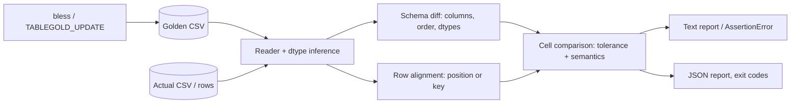

# tablegold

[English](README.md) | [中文](README.zh.md) | [日本語](README.ja.md)

[](LICENSE) [](CHANGELOG.md) [](pyproject.toml)  [](CONTRIBUTING.md)

**Open-source golden-file testing for CSV and tabular data — numeric tolerance, column order, dtype checks, so float noise never fails a build but real drift always does.**


```bash
git clone https://github.com/JaydenCJ/tablegold && cd tablegold && pip install -e .
```

> **Pre-release:** tablegold is not yet published to PyPI. Until the first release, clone [JaydenCJ/tablegold](https://github.com/JaydenCJ/tablegold) and run `pip install -e .` from the repository root. Zero runtime dependencies — the standard library is the whole stack.

## Why tablegold?

Golden-file testing is the cheapest regression net a data pipeline can have — until the goldens are byte-exact. Then every re-run fails on `1929.6562000000001` vs `1929.6562000000004`, on `1.5` vs `1.50`, on a harmless column reorder, and the team learns to re-bless on red, which is the same as having no test. The heavyweight escape is pulling a dataframe library into CI just to call an equality assert with tolerance. tablegold is the middle path: a zero-dependency comparator that parses what each cell *means* — numbers with symmetric rtol/atol, timezone-normalized datetimes, missing-value tokens — matches columns by name, aligns rows by key, and reports drift cell by cell with `|diff|` and `rel` receipts. Noise below your tolerance passes; schema drift and real value drift fail with an exit code CI can branch on.

|  | tablegold | pandas `assert_frame_equal` | datacompy | csv-diff |
|---|---|---|---|---|
| Numeric tolerance (rtol/atol, per column) | Yes, symmetric | Yes (asymmetric, global) | Yes (global) | No |
| Column order / dtype semantics | order-insensitive, inferred dtypes checked | `check_like` flag, dtype flags | column checks | not checked |
| Row alignment by key columns | Yes, with duplicate/missing-key reporting | index-based | Yes (join) | Yes |
| Standalone CLI with CI exit codes | Yes (`diff`, 0/1/2) | No (library assert) | No (library) | Yes |
| Golden lifecycle (bless / update mode) | Yes (`bless`, `TABLEGOLD_UPDATE=1`) | No | No | No |
| Runtime dependencies | 0 | pandas + numpy | pandas + numpy | click + dictdiffer |

<sub>Dependency counts are the declared runtime requirements on PyPI as of 2026-07. tablegold's count is `dependencies = []` in [pyproject.toml](pyproject.toml); the comparison reflects each tool's documented scope, not quality.</sub>

## Features

- **Tolerance that means what you say** — symmetric `|a-b| <= max(atol, rtol*max(|a|,|b|))` per column, with explicit NaN, infinity, and signed-zero rules; an integer count that is off by one still fails at any rtol.
- **Column-semantic, not byte-cosmetic** — columns match by name with reorders as notes, `1.50` equals `1.5`, `2026-07-01T09:00:00Z` equals `+00:00`, and `NA`/`null`/empty are the same hole.
- **Dtype checks with honest degrading** — every column gets an inferred dtype (`bool`/`int`/`float`/`date`/`datetime`/`string`); int→float widening is a note, any other type drift is an error, and `--strict-dtypes` forbids even the widening.
- **Key-aligned rows** — `--key id` compares reordered exports clean and reports duplicate, missing, and unexpected keys with example values instead of a wall of false diffs.
- **A report you can act on** — per-column mismatch counts, `|diff|`/`rel` magnitudes, truncated examples with exact totals, plus `--format json` (versioned schema) for tooling.
- **Golden lifecycle built in** — `assert_matches_golden` for test suites, a pytest fixture storing goldens next to the test, `bless` for canonical writing, and `TABLEGOLD_UPDATE=1` to re-bless a whole suite.

## Quickstart

Install:

```bash
git clone https://github.com/JaydenCJ/tablegold && cd tablegold && pip install -e .
```

Guard any tabular output — a CSV path, in-memory `list[dict]` rows, or a `Table`:

```python
from tablegold import assert_matches_golden

rows = build_report()  # your pipeline output
assert_matches_golden(rows, "goldens/report.csv", key=["id"], rtol=1e-9)
```

The first run with `TABLEGOLD_UPDATE=1` blesses the golden; afterwards float noise passes and drift raises an `AssertionError` carrying the full report. The same engine drives the CLI — from a checkout of this repository (real captured output):

```bash
tablegold diff --key region examples/goldens/daily_metrics.csv out/metrics_v1_1.csv
```

```text
tablegold: golden examples/goldens/daily_metrics.csv vs actual out/metrics_v1_1.csv
rows: 3 golden vs 3 actual, aligned by key (region)
result: MATCH (3 row(s) x 5 column(s) within tolerance)
```

Here `metrics_v1_1.csv` came from the same pipeline with a different fold order — every revenue differs in the last float bits, and none of it matters. A leaked 0.1% discount, however:

```bash
tablegold diff --key region examples/goldens/daily_metrics.csv out/metrics_discounted.csv
```

```text
tablegold: golden examples/goldens/daily_metrics.csv vs actual out/metrics_discounted.csv
rows: 3 golden vs 3 actual, aligned by key (region)
column revenue [float]: 2 of 3 values outside tolerance (rtol=1e-09, atol=1e-12)
  region=north: golden=1156.8966999999998 actual=1155.8661304999998  |diff|=1.03 rel=0.000891
  region=west: golden=2070.1846 actual=2068.9416688  |diff|=1.24 rel=0.0006
column avg_unit_price [float]: 2 of 3 values outside tolerance (rtol=1e-09, atol=1e-12)
  region=north: golden=88.99205384615382 actual=88.91277926923075  |diff|=0.0793 rel=0.000891
  region=west: golden=121.77556470588236 actual=121.70245110588236  |diff|=0.0731 rel=0.0006
result: MISMATCH (4 cell diff(s), 0 schema/row error(s), 0 note(s))
```

Exit code 1, so it slots straight into CI. Generate both files yourself with `python examples/pipeline_demo.py out` — the full walkthrough lives in [`examples/`](examples/), and the exact verdict rules in [`docs/comparison-semantics.md`](docs/comparison-semantics.md).

## Comparison options

| Key | Default | Effect |
|---|---|---|
| `rtol` / `--rtol` | `1e-9` | relative tolerance for float columns |
| `atol` / `--atol` | `1e-12` | absolute tolerance floor (dominates near zero) |
| `column_tolerances` / `--tol COL:RTOL[:ATOL]` | — | per-column override, replaces the defaults for that column |
| `key` / `--key COLS` | positional | align rows by these columns instead of by position |
| `ignore_columns` / `--ignore COLS` | — | exclude columns (timestamps, run ids) from the comparison |
| `strict_column_order` / `--strict-column-order` | `false` | changed column order becomes an error instead of a note |
| `strict_dtypes` / `--strict-dtypes` | `false` | forbid int→float widening; any dtype drift is an error |
| `allow_extra_columns` / `--allow-extra-columns` | `false` | extra actual columns become a note instead of an error |
| `nan_equal` / `--nan-differs` | NaN == NaN | flip to make NaN-vs-NaN a mismatch |
| `max_examples` / `--max-examples N` | `5` | mismatch examples printed per column (totals stay exact) |

The CLI exits `0` on match, `1` on mismatch, `2` on usage or read errors. In pytest, request the `tablegold` fixture: goldens live in `goldens/<test name>.csv` next to the test file, and `TABLEGOLD_UPDATE=1 pytest` (or `--tablegold-update`) re-blesses after an intended change.

## Verification

This repository ships no CI; every claim above is verified by local runs. Reproduce them from a checkout of this repository:

```bash
pip install -e '.[dev]' && pytest && bash scripts/smoke.sh
```

Output (copied from a real run, truncated with `...`):

```text
90 passed in 0.49s
...
[diff]   id=1002: golden=88.25 actual=90.25  |diff|=2 rel=0.0222
[diff] result: MISMATCH (1 cell diff(s), 0 schema/row error(s), 1 note(s))
SMOKE OK
```

## Architecture



## Roadmap

- [x] Comparison engine (tolerance, dtypes, keys), golden lifecycle, pytest fixture, CLI with JSON reports (v0.1.0)
- [ ] PyPI release with `pip install tablegold`
- [ ] Column renames: detect and pair renamed columns instead of missing+extra
- [ ] Parquet and JSON-lines readers behind the same comparison engine
- [ ] HTML report with side-by-side drifted cells for review comments

See the [open issues](https://github.com/JaydenCJ/tablegold/issues) for the full list.

## Contributing

Contributions are welcome — start with a [good first issue](https://github.com/JaydenCJ/tablegold/issues?q=is%3Aissue+is%3Aopen+label%3A%22good+first+issue%22) or open a [discussion](https://github.com/JaydenCJ/tablegold/discussions). See [CONTRIBUTING.md](CONTRIBUTING.md) for the development setup.

## License

[MIT](LICENSE)
