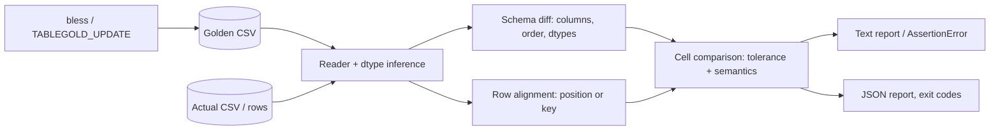

# tablegold

[English](README.md) | [中文](README.zh.md) | [日本語](README.ja.md)

[](LICENSE) [](CHANGELOG.md) [](pyproject.toml)  [](CONTRIBUTING.md)

**面向 CSV 与表格数据的开源 golden 文件测试工具——数值容差、列顺序、dtype 检查：浮点噪声永远不会打红构建，真正的漂移一定会。**


```bash
git clone https://github.com/JaydenCJ/tablegold && cd tablegold && pip install -e .
```

> **预发布：** tablegold 尚未发布到 PyPI。首个正式版之前，请克隆 [JaydenCJ/tablegold](https://github.com/JaydenCJ/tablegold) 并在仓库根目录执行 `pip install -e .`。零运行时依赖——标准库就是全部技术栈。

## 为什么选 tablegold？

golden 文件测试是数据管线最廉价的回归防护网——直到 golden 变成逐字节比对。从那一刻起，每次重跑都会因 `1929.6562000000001` vs `1929.6562000000004`、`1.5` vs `1.50`、一次无害的列重排而失败，团队学会了见红就重新 bless，这等于没有测试。重量级的出路是往 CI 里塞一个 dataframe 库，只为调用一次带容差的相等断言。tablegold 是中间道路：零依赖的比较器，解析每个单元格的*语义*——数值用对称的 rtol/atol、日期时间做时区归一、缺失值 token 统一处理——按列名匹配列、按 key 对齐行，并逐单元格报告漂移，附上 `|diff|` 与 `rel` 凭据。低于容差的噪声放行；schema 漂移与真实数值漂移则以 CI 可分支的退出码失败。

|  | tablegold | pandas `assert_frame_equal` | datacompy | csv-diff |
|---|---|---|---|---|
| 数值容差（rtol/atol、按列） | 有，对称 | 有（非对称、全局） | 有（全局） | 无 |
| 列顺序 / dtype 语义 | 顺序无关，检查推断 dtype | `check_like` 开关、dtype 开关 | 列检查 | 不检查 |
| 按 key 列对齐行 | 有，并报告重复/缺失 key | 基于索引 | 有（join） | 有 |
| 带 CI 退出码的独立 CLI | 有（`diff`，0/1/2） | 无（库内断言） | 无（库） | 有 |
| golden 生命周期（bless / 更新模式） | 有（`bless`、`TABLEGOLD_UPDATE=1`） | 无 | 无 | 无 |
| 运行时依赖 | 0 | pandas + numpy | pandas + numpy | click + dictdiffer |

<sub>依赖数为 2026-07 时各工具在 PyPI 上声明的运行时依赖。tablegold 的数字对应 [pyproject.toml](pyproject.toml) 中的 `dependencies = []`；本对比反映各工具文档化的定位，而非质量。</sub>

## 特性

- **容差说到做到** — 按列的对称 `|a-b| <= max(atol, rtol*max(|a|,|b|))`，NaN、无穷、带符号零均有明确规则；整数计数差一，无论 rtol 多宽都会失败。
- **列语义，而非字节表象** — 列按名字匹配、重排只是 note；`1.50` 等于 `1.5`，`2026-07-01T09:00:00Z` 等于 `+00:00`，`NA`/`null`/空串是同一个空洞。
- **诚实降级的 dtype 检查** — 每列推断一个 dtype（`bool`/`int`/`float`/`date`/`datetime`/`string`）；int→float 拓宽是 note，其他类型漂移是 error，`--strict-dtypes` 连拓宽也禁止。
- **按 key 对齐的行** — `--key id` 让乱序导出干净通过，并用示例值报告重复、缺失、多余的 key，而不是刷一屏假 diff。
- **可直接行动的报告** — 每列不匹配计数、`|diff|`/`rel` 幅度、示例截断但总数精确，另有 `--format json`（版本化 schema）供工具消费。
- **内建 golden 生命周期** — 测试套件用 `assert_matches_golden`，pytest fixture 把 golden 存在测试文件旁边，`bless` 规范化写入，`TABLEGOLD_UPDATE=1` 一键重新 bless 整套。

## 快速上手

安装：

```bash
git clone https://github.com/JaydenCJ/tablegold && cd tablegold && pip install -e .
```

守护任何表格输出——CSV 路径、内存中的 `list[dict]` 行、或 `Table`：

```python
from tablegold import assert_matches_golden

rows = build_report()  # your pipeline output
assert_matches_golden(rows, "goldens/report.csv", key=["id"], rtol=1e-9)
```

首次以 `TABLEGOLD_UPDATE=1` 运行即 bless golden；此后浮点噪声放行，漂移则抛出携带完整报告的 `AssertionError`。同一引擎驱动 CLI——在本仓库 checkout 中执行（真实捕获的输出）：

```bash
tablegold diff --key region examples/goldens/daily_metrics.csv out/metrics_v1_1.csv
```

```text
tablegold: golden examples/goldens/daily_metrics.csv vs actual out/metrics_v1_1.csv
rows: 3 golden vs 3 actual, aligned by key (region)
result: MATCH (3 row(s) x 5 column(s) within tolerance)
```

这里的 `metrics_v1_1.csv` 出自同一条管线、只是求和折叠顺序不同——每个 revenue 都在浮点最后几位上不同，而这些全都无关紧要。但一个泄漏进来的 0.1% 折扣：

```bash
tablegold diff --key region examples/goldens/daily_metrics.csv out/metrics_discounted.csv
```

```text
tablegold: golden examples/goldens/daily_metrics.csv vs actual out/metrics_discounted.csv
rows: 3 golden vs 3 actual, aligned by key (region)
column revenue [float]: 2 of 3 values outside tolerance (rtol=1e-09, atol=1e-12)
  region=north: golden=1156.8966999999998 actual=1155.8661304999998  |diff|=1.03 rel=0.000891
  region=west: golden=2070.1846 actual=2068.9416688  |diff|=1.24 rel=0.0006
column avg_unit_price [float]: 2 of 3 values outside tolerance (rtol=1e-09, atol=1e-12)
  region=north: golden=88.99205384615382 actual=88.91277926923075  |diff|=0.0793 rel=0.000891
  region=west: golden=121.77556470588236 actual=121.70245110588236  |diff|=0.0731 rel=0.0006
result: MISMATCH (4 cell diff(s), 0 schema/row error(s), 0 note(s))
```

退出码为 1，可直接嵌入 CI。用 `python examples/pipeline_demo.py out` 自己生成这两个文件——完整演练见 [`examples/`](examples/)，判定规则的精确定义见 [`docs/comparison-semantics.md`](docs/comparison-semantics.md)。

## 比较选项

| Key | 默认值 | 效果 |
|---|---|---|
| `rtol` / `--rtol` | `1e-9` | 浮点列的相对容差 |
| `atol` / `--atol` | `1e-12` | 绝对容差下限（零附近起主导作用） |
| `column_tolerances` / `--tol COL:RTOL[:ATOL]` | — | 按列覆盖，完全替换该列的默认值 |
| `key` / `--key COLS` | 按位置 | 用这些列对齐行，而不是按位置 |
| `ignore_columns` / `--ignore COLS` | — | 将某些列（时间戳、run id）排除出比较 |
| `strict_column_order` / `--strict-column-order` | `false` | 列顺序变化从 note 升级为 error |
| `strict_dtypes` / `--strict-dtypes` | `false` | 禁止 int→float 拓宽；任何 dtype 漂移都是 error |
| `allow_extra_columns` / `--allow-extra-columns` | `false` | actual 侧多出的列降级为 note 而非 error |
| `nan_equal` / `--nan-differs` | NaN == NaN | 反转后 NaN-vs-NaN 记为不匹配 |
| `max_examples` / `--max-examples N` | `5` | 每列打印的不匹配示例数（总数保持精确） |

CLI 匹配时退出 `0`，不匹配退出 `1`，用法或读取错误退出 `2`。在 pytest 中请求 `tablegold` fixture：golden 存放在测试文件旁的 `goldens/<test name>.csv`，有意变更后用 `TABLEGOLD_UPDATE=1 pytest`（或 `--tablegold-update`）重新 bless。

## 验证

本仓库不带 CI；以上所有断言都由本地运行验证。在本仓库的 checkout 中复现：

```bash
pip install -e '.[dev]' && pytest && bash scripts/smoke.sh
```

输出（摘自一次真实运行，用 `...` 截断）：

```text
90 passed in 0.49s
...
[diff]   id=1002: golden=88.25 actual=90.25  |diff|=2 rel=0.0222
[diff] result: MISMATCH (1 cell diff(s), 0 schema/row error(s), 1 note(s))
SMOKE OK
```

## 架构



## 路线图

- [x] 比较引擎（容差、dtype、key）、golden 生命周期、pytest fixture、带 JSON 报告的 CLI（v0.1.0）
- [ ] 发布到 PyPI，支持 `pip install tablegold`
- [ ] 列改名：检测并配对改名的列，而非报缺失+多余
- [ ] 在同一比较引擎之上支持 Parquet 与 JSON-lines 读取
- [ ] HTML 报告：漂移单元格并排展示，方便评审留言

完整列表见 [open issues](https://github.com/JaydenCJ/tablegold/issues)。

## 贡献

欢迎贡献——从 [good first issue](https://github.com/JaydenCJ/tablegold/issues?q=is%3Aissue+is%3Aopen+label%3A%22good+first+issue%22) 开始，或发起一个 [discussion](https://github.com/JaydenCJ/tablegold/discussions)。开发环境搭建见 [CONTRIBUTING.md](CONTRIBUTING.md)。

## 许可证

[MIT](LICENSE)
